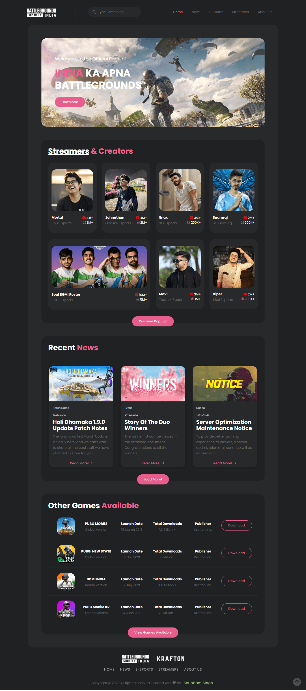
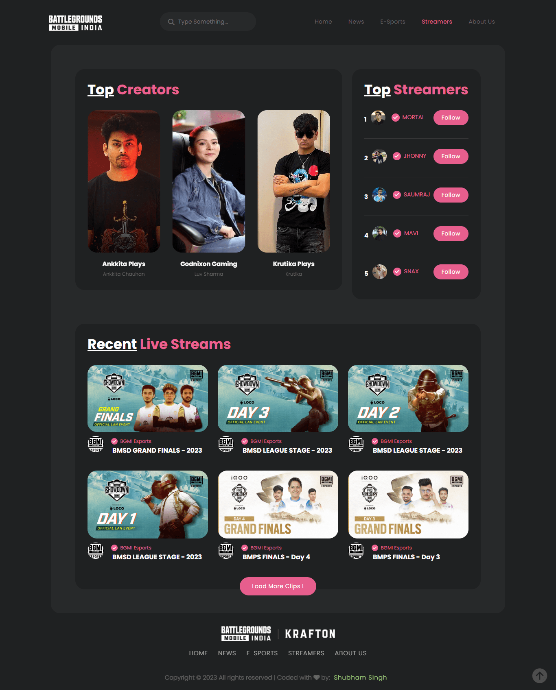

# Modern Gaming Website [ BGMI ]

## Description

A modern gaming website built with React Router Dom, featuring Bootstrap and Swiper components. 🎮🕹️

The website is designed specifically for <b> fans of Battlegrounds Mobile India </b>, a popular mobile game in India. The website's layout and design are optimized for both desktop and mobile screens, making it easy for users to navigate and find the information they need.📝👀🎬🎥👨‍💻

With React Helmet Async and Markdown-to-JSX, the website offers a news page, esports page, and streamers page, along with information on esports teams and streamers/creators of Battlegrounds Mobile India. 📝👀🎬

The streamers page features video clips of popular streamers and creators of Battlegrounds Mobile India. Users can watch these videos in a modal window, which provides a seamless viewing experience without interrupting the user's browsing experience.🎮📱🌐🕹️🔥💻

## Links for Project

- ### 📌 [LIVE Project Link](https://bgmi-india.netlify.app/)

- ### 📌 [YouTube Link](https://youtu.be/6jJogCqIZT0)

## Tech Stack Used

## Key features:

- 🎮 Modern gaming website for Battlegrounds Mobile India.

- 📱 Responsive design optimized for all screens.

- 🌐 Built using React Router Dom for seamless navigation.

- 🎨 Sleek design featuring Bootstrap and Swiper components.

- 📰 News, esports, and streamers pages powered by React Helmet Async and Markdown-to-JSX.

- 🎮 Detailed information on esports teams and popular streamers/creators of Battlegrounds Mobile India.

- 🎬 Video clips of popular streamers and creators, viewable in modals for enhanced viewing.

## Project Screen Shot(s)

### Home Page

### Streamers Page

### [VISIT WEBSITE HERE](https://bgmi-india.netlify.app/)

### [WATCH DEMO HERE](https://youtu.be/6jJogCqIZT0)

## Important Infomartion regarding Images & Content

As a part of my learning process , I used some of images and content [ news-articles ] from the official <b> Battlegrounds Mobile India </b> to practice incorporating pre-existing resources into my project.

I have taken steps to ensure that I am using the images and content in compliance with Krafton's terms of service.

Photos of the creators/streamers are in the public domain. The copyright of these pictures belongs to their original publisher/photographer as the case may be. If some of the photos are not appropriate for you or if you think your copyright has been violated, please write to shubhambhoj3@gmail.com. I will immediately remove those photos.

While I understand the importance of respecting intellectual property rights and obtaining proper permissions and licenses for third-party content, I wanted to use this as a learning opportunity to understand how to properly attribute and use existing resources in my own work.

If you have any questions or concerns about the use of images and content in this app, please don't hesitate to contact me.

## Connect with Me

- [Mailto](mailto:shubhambhoj3@gmail.com)

- [LinkedIn](https://www.linkedin.com/in/shubham-singh-b122b7171/)

---

[GO TO TOP](#battlegrounds-mobile-india)
